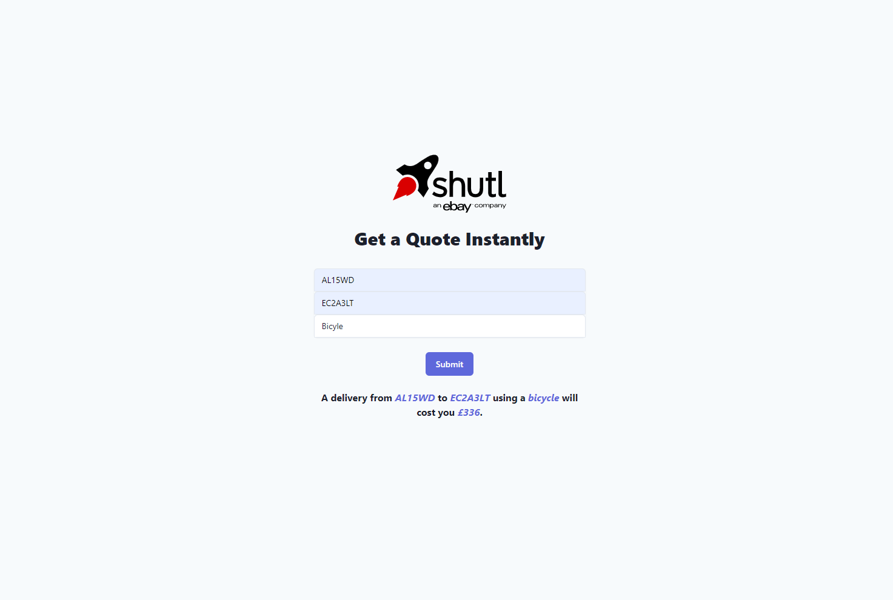
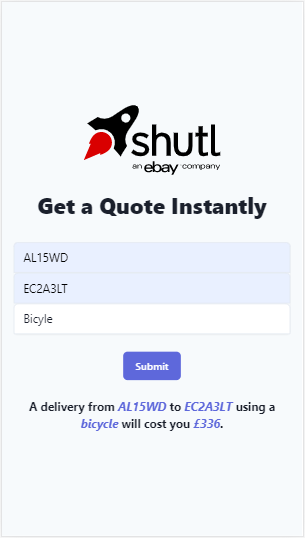

# Take home exercise

### Description

For our tech test, we'd like you to take a stripped-down version of our quoting engine, and then add some features. This is a RESTful service endpoint that takes a few details and works out the price for a delivery.

Throughout the test we're looking for great coding style, driving your code through tests (and refactoring) and at all times doing the bare minimum possible to get the job done. If you don't like the code or tests that are there already, feel free to refactor as you add features.

Please ensure that the features you complete are done to a standard that you're happy with, taking into account the time guideline below. Please complete the features in order.

Read this document thoroughly before starting your work. You are welcome to contact us if you have any question.

Please ensure that you include a readme file with any commands/thoughts/assumptions or anything else you would like us to know about your solution.

Good luck! :)


### Submitting your work:

To submit, please clone this repo and then push it onto your own GitHub account. **Do not fork this repo!** Then make the changes as you see fit. When you completed the test, please email the link to YOUR repo/pull request to 
DL-eBay-Shipping-London-Intern-Hiring@ebay.com. There is no deadline for submission but keep in mind that we will review the PRs in the order they come in.

## Completed Feature

### 1) Simple variable prices by vehicle

Build a basic service that responds to a POST to /quotes, with the following request structure:

```
{
  "pickup_postcode":   "SW1A1AA",
  "delivery_postcode": "EC2A3LT"
}
```
And responds with the following price:
```
{
  "pickup_postcode":   "SW1A1AA",
  "delivery_postcode": "EC2A3LT",
  "price":             316
}
```

The price we charge depends on the distance between two postcodes. We are not implementing postcode geocoding here, so instead we are using basic formula for working out the price for a quote between two postcodes. The process is to take the base-36 integer of each postcode, subtract the delivery postcode from the pickup postcode and then divide by some large number. If the result is negative, turn it into a positive.

Hint: in java, this would be:

`Long.valueOf("SW1A1AA", 36) - Long.valueOf("EC2A3LT", 36)`

If you have a better idea for a deterministic way of making a number from two postcodes, please feel free to use that instead. Update your service to calculate pricing based upon these rules.


### 1) Api that returns prices based vehicle type and distance between two postcodes
A basic service that responds to a POST to /quotes
The price we charge depends on the distance between two postcodes. 
Our price changes based upon the vehicle, by applying the appropriate markup:

* bicycle: 10%
* motorbike: 15%
* parcel_car: 20%
* small_van: 30%
* large_van: 40%

For example, if the base price was 100, the `small_van` price with markup will be 130.
The vehicle is returned in the response, and the price is rounded to the nearest integer.

Request:
```
{
  "pickupPostcode":   "SW1A1AA",
  "deliveryPostcode": "EC2A3LT",
  "vehicle": "bicycle"
}
```
Response:
```
{
  "pickupPostcode":   "SW1A1AA",
  "deliveryPostcode": "EC2A3LT"
  "vehicle": "bicycle"
  "price": 348
}
```

### 3) Interface

The frontend is a Single Page [React](https://reactjs.org/) app, using [tailwindcss](https://tailwindcss.com/) as it's CSS framework.

It makes the calls outlined above.

It contains a form with the following fields:
`pickup_postcode`, `delivery_postcode` and `vehicle`.

Under the form, based on the response, the price is listed in the following format:
`A delivery from <pickup_postcode> to <delivery_postcode> using a <vehicle> will cost you £<price>.`

While the page is waiting for the response, an appropriate message should be displayed.

- The page displays well both on smaller and larger screens, ie that is `responsive`.
    - Desktop screenshot: 
    
    
    
    - Mobile screenshot:
    
    
                          
- The page does not need to be reloaded when the form is submitted

# Dependencies

`gradle`: make sure is correctly installed on your machine. `brew` can help you with the installation if you are using a Mac Machine.

## Useful commands

Run tests from command line:
```
gradle test
```

Run server locally:
```
gradle bootRun
```

Make quote request:
```
echo '{"pickupPostcode": "SW1A1AA", "deliveryPostcode": "EC2A3LT" }' | \
curl -d @- http://localhost:8080/quote --header "Content-Type:application/json"
```

# Thoughts/Assumptions/Shortcomings

* I notice that the exercise specifies that the information should be sent to the API via a post request - I personally believe a GET request would be a better choice as the functionality of the request makes it a safe one.
* I had to rush a bit due to time constraints at work, so testing isn't as thorough as I would have liked it to be
* There is no input validation on the frontend, and no exception handling on the frontend or the backend. 
    * If I had more time I would have written exception handling code on the API, to ensure meaningful HTTP status codes are returned
    * I would have also written exception handling code for the AJAX portion of the code so that meaninful error messages are returned to the user
    * I would have used HTML5/REGEX validation for the frontend